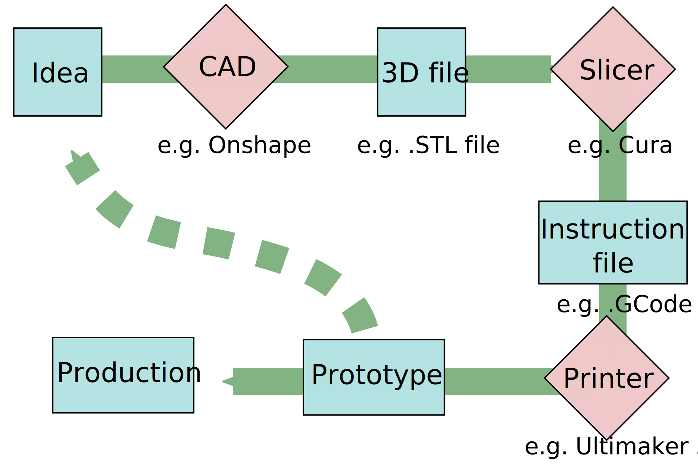

# The workflow {-}

The whole workflow can be implemented by **1 person** in **1 day**.

## Example 1: design a simple spacer {-}

1. Make a new onshape document
2. Make a sketch on the "top/bottom" plane
3. Draw two concentric circles and set *their diameters* (using the dimension tool)
4. Exit the sketch 
5. Extrude the surface between the two circles (set the *height*)
6. Right click on the new part, then on "Export...".  Download as an *STL binary file* (resolution = fine, unit millimetrr)
8. Open in Cura
9. Place, multiply,...
10. Set resolution to fine (layer height = 0.06)
11. Prepare and save to a memory stick
12. Start the printer

Note that the same result could be achieved through a "revolution" rather than an "extrusion"

## Example 2: a custom tube holder {-}

